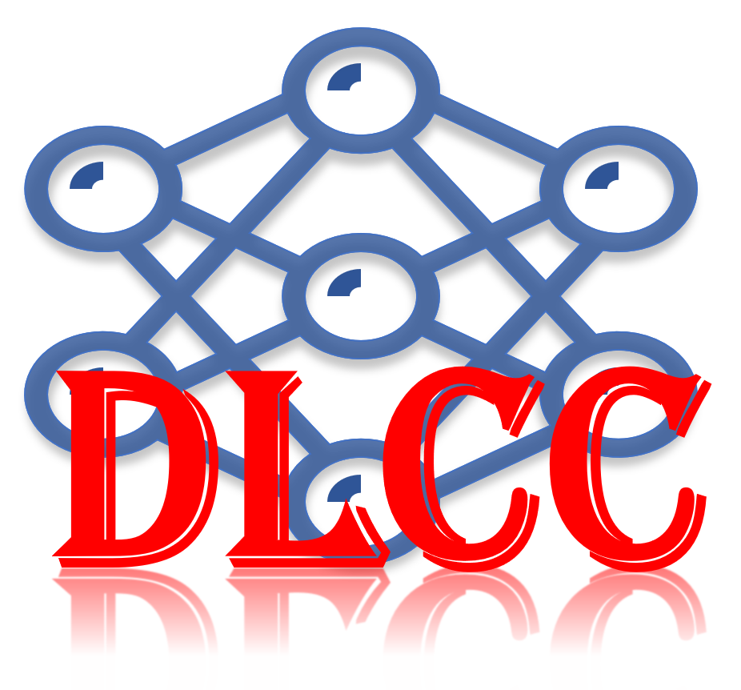
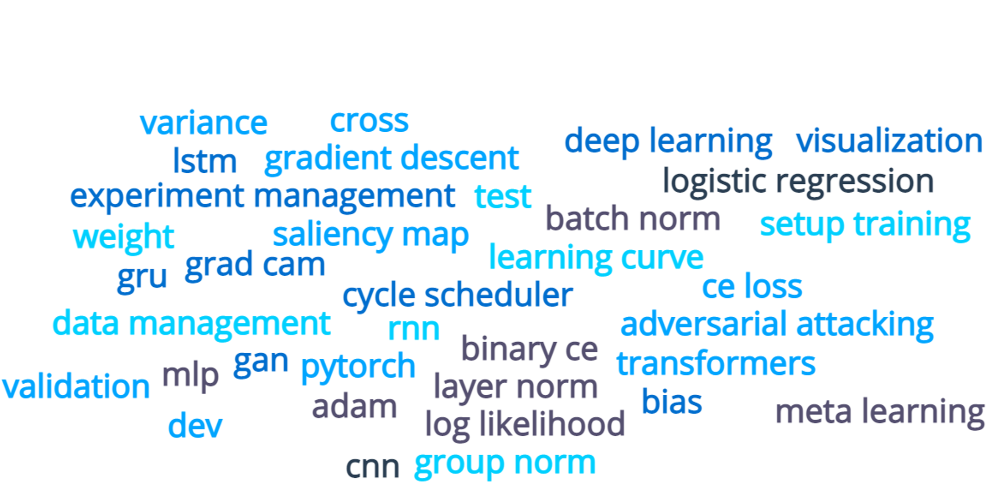
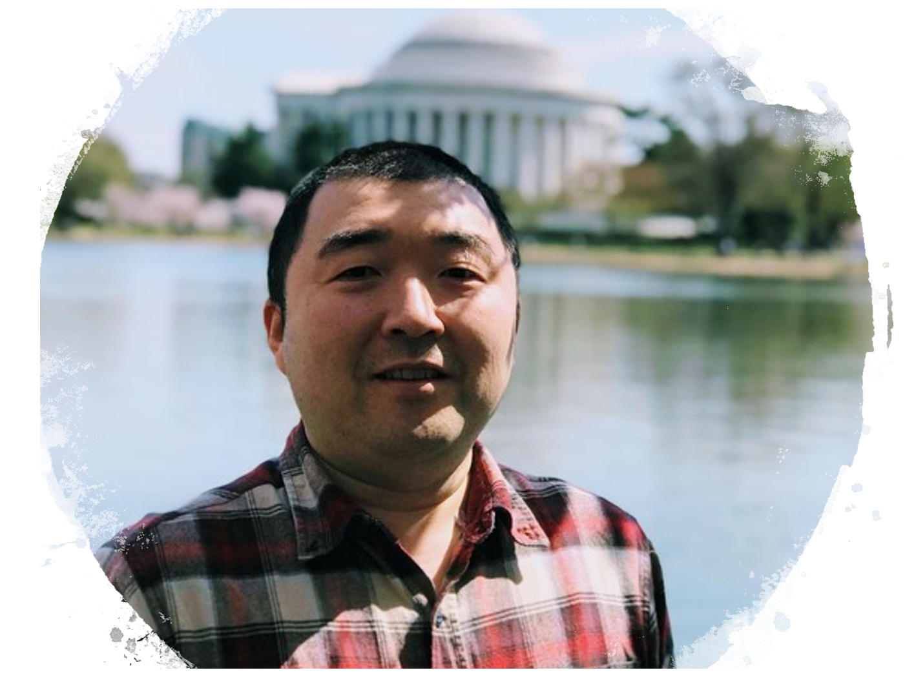

 

# **Deep Learning Crash Course**

---
*To spread the knowledge of deep learning among domain experts.*

---

## Overview

Deep learning is emerging as a major disruptive technology in biomedical and clinical research. It is also a skill with high demand in the decade to come. This course aims to teach the foundations to understand how neural network works and also introduce latest developments. You will build your own neural networks and gain skills to apply deep learning to your field.

### Why was this course developed

There are a few very good deep learning courses (e.g. [Stanford CS230](https://cs230.stanford.edu/), [Stanford CS231n](http://cs231n.stanford.edu/), [CMU Into to DL](https://deeplearning.cs.cmu.edu/F21/index.html) etc.). But for the general audiences, the related costs are high and seats are limited. 

There are strong interests in the community where I am working (such as, [NHLBI, NIH](https://www.nhlbi.nih.gov/)) for deep learning. Many trainees and colleagues want to apply this technique, from biology to microscopy, from clinical imaging to epidemiology. As the deep learning has not yet penetrated these fields, it is of great interest to expect breakthroughs by applying deep learning there.

This course is designed for domain experts to provide in-depth review of deep learning technique. The expected outcome is that one can start apply DL to his/her unique problems after completion of course materials and assignments.

As advocated in this [great post](https://medium.datadriveninvestor.com/ai-x-dont-switch-careers-add-ai-34eff21dd3e1), add deep learning to your expertise!

## Who is this course for

This course is for anyone who is willing to learn the deep learning. Before diving into the subjects, it is the best to review basic linear algebra and probability theory. Python programming is used through out the course, so getting familiar with python is necessary.

Some good materials for mathematics and python programming:

* [Stanford CS229-linalg](http://cs229.stanford.edu/summer2020/cs229-linalg.pdf)
* [Dive Into DL, math appendix](http://www.d2l.ai/chapter_appendix-mathematics-for-deep-learning/index.html)
* [Learning Python](https://cfm.ehu.es/ricardo/docs/python/Learning_Python.pdf)
* [Python Crash Course, one of the easiest tutorial](https://www.programmer-books.com/wp-content/uploads/2018/06/Python%20Crash%20Course%20-%20A%20Hands-On,%20Project-Based%20Introduction%20to%20Programming.pdf)
* [Numpy tutorial](https://cs231n.github.io/python-numpy-tutorial/)
* [Debug Python using vscode](https://code.visualstudio.com/docs/python/python-tutorial)

These materials contain sufficient information to understand and apply deep learning. After reviewing them, you will be prepared to start this journal.

## Course content

Neural Network basics, backprop, optimization, loss function, setup and monitor your training, convolution neural network, recurrent neural network, transformer, attention mechanism, generative adversarial network, adversarial attacking, visualization of neural network, 
transfer learning, meta learning, contrastive learning, data management, experiment management, etc.

## Who will teach

 [Hui Xue](https://www.linkedin.com/in/huixue-nhlbi) is an active researcher on developing deep learning based imaging applications. The AI imaging products he developed had been deployed at more than forty hospitals globally and used daily to help cardiologists.
---
 

 [David Hansen](https://www.linkedin.com/in/david-hansen-4b86a535/) is the founder and technical
director of Gradient Software, Inc. He is an experienced developer in deep learning.
---
 
 

## Course offerings
- 📯 [NHLBI 2021](nhlbi2021.md) 
- 🧬 [BIO398.81 Practical Deep Learning, FAES 2021](faes2021.md)