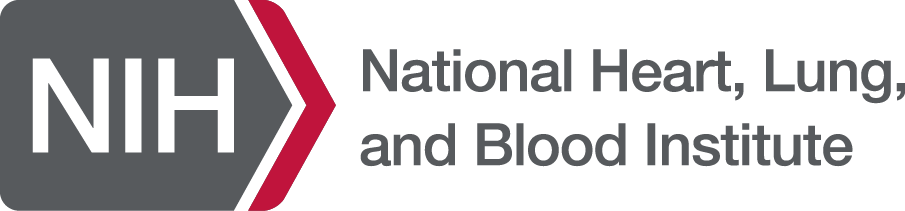
___
# NHLBI, 2021 Fall

This offering is for Division of Intramural (DIR), NHLBI in Fall, 2021. The course consists of 12 lectures. We will start from basics of neural networks, introduce the loss function, optimization and how to setup and manage the training session. The next section is the convolutional neural network for imaging and vision tasks. We will learn the recurrent neural network (RNN) for the sequence data. More recently, attention mechanism and transformer models (BERT, GPT family etc.) are very popular. They are introduced after RNN. We will teach generative model and in details the GAN (generative adversarial network). The technique to visualize the neural network is introduced to help understand how and why the neural network works. The course will end with a focus on how to handle "small dataset" usecase, as in many practical applications, we may not be able to acquire large labelled dataset. Three techniques are introduced, transfer learning, meta learning and contrastive learning (as the more recent development of self-supervised learning).

For the NHLBI DIR community, the teaching objectives are:

    * Introduce the basics of deep learning
    * Present in-math how DL model works
    * Provide practices to build your own model
    * Grow interest and improve community awareness
    * Prepare trainees and fellows for DL related jobs

For the student point of view, you will gradually learn the concepts and algorithms behind the deep neural network and master the tools required to build and train models. For every lecture, it comes with a reading list to broaden the understanding. 

Assignments consist of questions and coding components and will be opened to student during teaching weeks. The focus is the understanding of basic concepts and how to design and apply deep learning to  different problems. 

We will use [Pytorch](www.pytorch.org). So it is a good idea to get yourself familiar with this [package](https://pytorch.org/tutorials/).

## Prerequisites

Please review the mathematics for deep learning and learn basic Python and Numpy. 

* [mathematics for deep learning](http://cs229.stanford.edu/summer2020/cs229-linalg.pdf)
* [Python, a more comprehensive book](https://cfm.ehu.es/ricardo/docs/python/Learning_Python.pdf)
* [Python Crash Course, one of the easiest tutorial](https://www.programmer-books.com/wp-content/uploads/2018/06/Python%20Crash%20Course%20-%20A%20Hands-On,%20Project-Based%20Introduction%20to%20Programming.pdf)
* [Numpy](https://cs231n.github.io/python-numpy-tutorial/)
* [Pytorch tutorial](https://pytorch.org/tutorials/)
* [Debug python program using VSCode](https://www.youtube.com/watch?v=W--_EOzdTHk)

## Instructors

* Hui Xue, hui.xue@nih.gov
* David Hansen, davidchansen@gradientsoftware.net

## Schedule

Starting on the week of Sep 13, 2021

* Lecture, every Wed, 11:00am-12:30pm, US EST time
    - https://us02web.zoom.us/j/2417250866?pwd=Zm9aTmgyZjNXdGRtUitmM0RGVXZPQT09

* Q&A session, every Friday, 11:00am-12:00pm, US EST time
    - https://us02web.zoom.us/j/2417250866?pwd=Zm9aTmgyZjNXdGRtUitmM0RGVXZPQT09

## Course projects

The course project is a great opportunity to apply deep learning to a problem of your interests. Given the very diverse background of course participants, it is of interests to see what deep learning may do in your domain. 

I would encourage you to think about a few ideas about how to apply DL to a problem in your domain. To get started, try to ask questions such as:

- Do I have a clear goal for what the model should do? E.g. segment a specific vessel and measure its diameter, or predict the outcome for a certain patient cohort, or improve imaging signal-noise-ratio or reduce radiation dose.

- Do I have data available, or whether I can start collecting data? Maybe data is generated in your workflow, but not saved. There are also openly available datasets.

- Is there a clear way to label the data? Maybe it is hard to come out a good data labelling strategy at the beginning. But can you get started and refine the data labelling after gaining more experience?

- How will you design the loss function and what is a possible model architecture? For these technical questions, there may be publications using deep learning for your domain. It is a good idea to review some papers to see how others formatted the problem.

- After building the model, will it be useful to improve your workflow or even become a *deployed* component? For example, a model to improve imaging SNR can be deployed and used regularly in experiments. If so, you will have a way to continuously adding new data to your dataset.

You can work in a team of up to 3 people. You can consult any resources (e.g. github repo, books, papers, code by others etc.). But you are expected to collect, label/clean datasets, design and implement model, conduct the training, validating the model. In short, you are expected to **drive a deep learning project**. 

The course projects consist of three stages: proposal, milestone and final report. 

- **Proposal** should be no more than one page. Try to state clearly about: what is the problem you are trying to solve with DL? What dataset will you use? If you are going to collect data, what is the strategy and timeline to curate a dataset? Ideas about model design and training. Finally, you should anticipate the expected outcome.

- **Milestone** should be no more than 3 pages, including: Introduction, Method, Dataset, Preliminary results and Discussion. You should clearly state the problem, technical route and possible further improvement.

- **Final report** should be up to 5 pages, including, Introduction, Related work if any, Method, Dataset, Training details, Results, Model deployment if applicable, Discussion, and Conclusion. Consider this final report to be the fist draft of your deep learning paper submitted to a good journal in your domain! 

## Syllabus

### **Prologue**

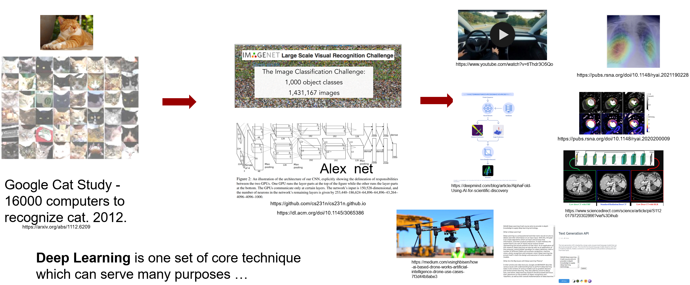

**Why do we want to spend hours in learning deep learning (DL)?** 
I can articulate one reason: Deep Learning is a set of key technique which can be applied to many fields, from mobile phone to medical imaging, from robotics to online shopping, from new drug discovery to genomics. What is really amazing to me is that in this wave of technological revolution, the **same** set of technique, deep neural network, is solving many challenging problems which are drastically different. Yes, it is the same set of algorithms, software toolboxes and knowledge base are applied, reporting state-of-the-art performance.

This makes learning deep learning rewardable, because you will master something which can be widely applied and mostly likely will stay that way in the decades to come. According to ARK's research, deep learning will add $30 trillion to the global equity market capitalization during the next 15-20 years*. No something which should be ignored!

However, there are difficulties along the way. Often, more than superficial level of understanding of DL is required, if you want to find a notch to apply DL in your field and if no one has done this before you. There will not be pre-trained models which you can download. One has to understand the problem and design the model, invent new loss functions and put all pieces together to build a DL solution. Your solution needs to prove its value in deployment and gets better over time.

This course is to equip you with required knowledge to understand and apply DL by teaching how the deep neural network models work and by reviewing many DL architectures and applications. My hope is after this learning process, domain experts will feel confident to apply DL to their specific problems and datasets.

#### Video

[Click here](https://www.youtube.com/watch?v=-I5TjyzDLpE)

#### Slides

[PDF Download](slides/Prologue.pdf)

#### Suggested Reading

* \*For big pictures and where DL can fit, [Ark Big Idea](https://research.ark-invest.com/hubfs/1_Download_Files_ARK-Invest/White_Papers/ARK%E2%80%93Invest_BigIdeas_2021.pdf)
* Artificial Intelligence Index Report 2021, [AI report](https://aiindex.stanford.edu/wp-content/uploads/2021/03/2021-AI-Index-Report_Master.pdf)
___
### **Lecture 1**

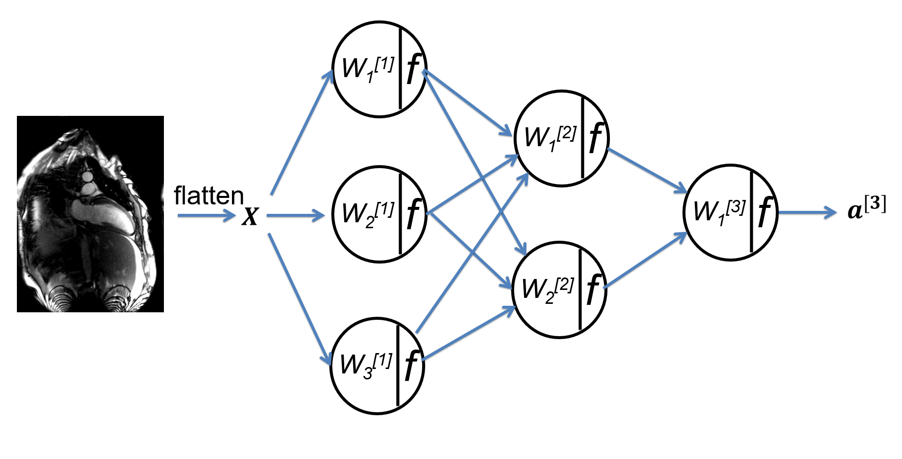

We start by motivating the deep learning for its broad applicability and future growth, and then introduce deep learning as a data driven approach. The basic terminology of neural network are reviewed. We set the stage for future discussion to introduce the binary and multi-class classification problems and the multi-layer perceptron (MLP) network. Other topics covered in this lecture include matrix broadcasting, universal approximation, logits, activation function etc.

#### Video

[Click here](https://www.youtube.com/watch?v=lPquVtduVLs)

#### Slides

[PDF Download](slides/lecture_1.pdf)

#### Suggested Reading

The same three authors wrote these two papers at the beginning of DL revolution and now. It is interesting to read and compare them.

* [Deep learning, Nature volume 521, 436–444 (2015)](https://www.nature.com/articles/nature14539.pdf)
* [Deep learning for all](https://dl.acm.org/doi/pdf/10.1145/3448250)
___
### **Lecture 2**

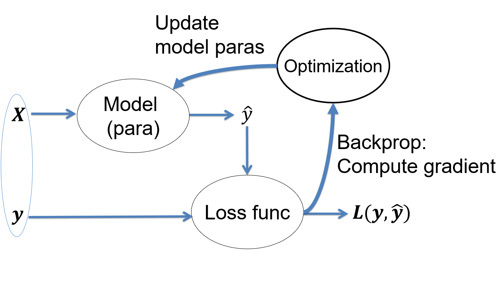

This lecture introduces the concept of loss function to evaluate how well our model fits the data. The process to adjust model parameters to fit the data is called optimization. Gradient descent is a common algorithm used to optimize the model parameters, given the input dataset. This process is the training. We will review different training algorithms and introduce the concepts of training and testing. To measure our model performance in training and testing datasets, the bias and variance of model should be estimated. Other concepts introduced in this lecture include regularization, under-fitting, over-fitting, batch and mini-batch etc.

#### Video

[Click here](https://www.youtube.com/watch?v=1_SdpuBwMWM)

#### Slides

[PDF Download](slides/lecture_2.pdf)

#### Suggested Reading

* [Notes on optimization](https://cs231n.github.io/optimization-1/)
* [Loss functions in deep learning by Artem Oppermann](./Loss Functions in Deep Learning _ MLearning.ai.pdf)
* [Bias and variance](https://www.bradyneal.com/bias-variance-tradeoff-textbooks-update)
___
### **Lecture 3**

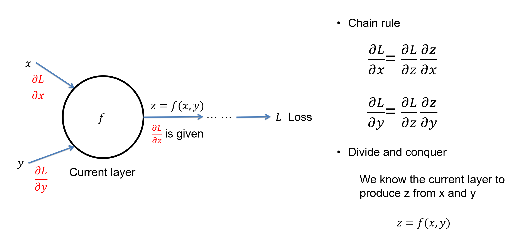

The key step to train a model is to follow the negative gradient direction to reduce the loss. But how do we compute the gradient direction? Through a process called the back propagation or backprop in short. This lecture discusses the backprop in detail. Backprop is based on two ideas: chain rule of derivative and divide-and-conquer. It allows us to compute complex derivative from loss to every learnable parameters in the model. 

We will not review GPU devices for deep learning in lectures. Please review two documents in this week's reading list.

#### Video

[Click here](https://www.youtube.com/watch?v=JGTbGpGcZGg)

#### Slides

[PDF Download](slides/lecture_3.pdf)

#### Suggested Reading

* [How backprop works](http://neuralnetworksanddeeplearning.com/chap2.html)
* [Derivatives of tensor](http://cs231n.stanford.edu/handouts/derivatives.pdf)
* [Autograd in Pytorch](https://pytorch.org/tutorials/beginner/blitz/autograd_tutorial.html)
* [GPU in Pytorch](https://www.run.ai/guides/gpu-deep-learning/pytorch-gpu/)
* [GPU for deep learning](https://timdettmers.com/2020/09/07/which-gpu-for-deep-learning/)
___
### **Assignment 1**

[Download the Assignment 1](https://gadgetrondata.blob.core.windows.net/dlcc/dlcc_assignment1.zip)

In this assignment, you will be asked to implement the multi-layer perceptron model and cross-entropy loss. The coding problem will require the implementation for both forward pass and backprop. The gradient descent is used to train the model for higher classification accuracy. We will not use deep learning framework in this assignment, but will use Python+Numpy combination. The goal is to make sure the thorough understanding of mathematics and numeric technique necessary for a classic neural network. Also, it is to encourage one to get familiar with python coding.

This assignment introduces the regression test for model training and evaluation. The [Pytest](https://docs.pytest.org/en/6.2.x/) is used for the regression test purpose.

[Download the linear regression demo](slides/linear_regression.py)

### **Note 1**

[Download the Note 1](slides/Derivative_of_CE_Loss.pdf)

In this note, the derivative of CE loss to the score vector is derived, step by step, including taking the gradient through the softmax function. This is an important step to understand the math behind MLP and classification loss.

___
### **Lecture 4**

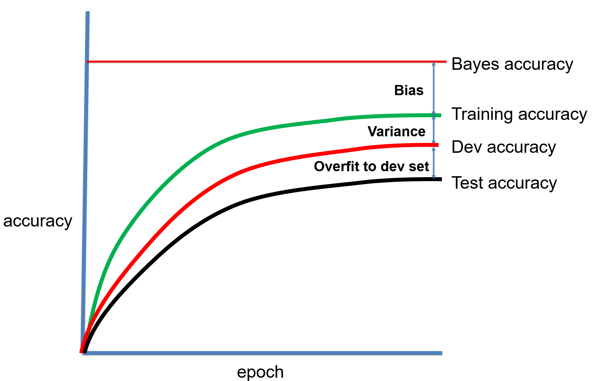

This lecture will finish our discussion on different optimization algorithms. We will introduce a few new methods and compare their pros and cons. The concept of hyper-parameter is explained, where a very important one is the learning rate. Different learning rate scheduling strategies are discussed in this lecture and help boost training performance. To search a good configuration of hyper-parameters, we will discuss coarse-to-fine, hyper-band and Bayesian methods. We close the lecture by discussing bag of tricks to set up the training process and cross-validation.

#### Video

[To be added]()

#### Slides

[PDF Download]()

#### Suggested Reading

* [Optimization in deep learning](https://ruder.io/optimizing-gradient-descent/)
* [Learning rate scheduler in Pytorch](https://www.kaggle.com/isbhargav/guide-to-pytorch-learning-rate-scheduling)
* [One-cycle learning rate scheduler](https://arxiv.org/pdf/1803.09820.pdf)
* [One-cycle learning rate scheduler, post](https://towardsdatascience.com/finding-good-learning-rate-and-the-one-cycle-policy-7159fe1db5d6)
* [Hyper-parameter searching](https://arxiv.org/pdf/2003.05689.pdf)
* [Set up training, chapter 40, 41, 42](https://d2wvfoqc9gyqzf.cloudfront.net/content/uploads/2018/09/Ng-MLY01-13.pdf)
* [DL experiment management](./A quick guide to managing machine learning experiments _ by Shashank Prasanna _ Towards Data Science.pdf)

___
### **Lecture 5**

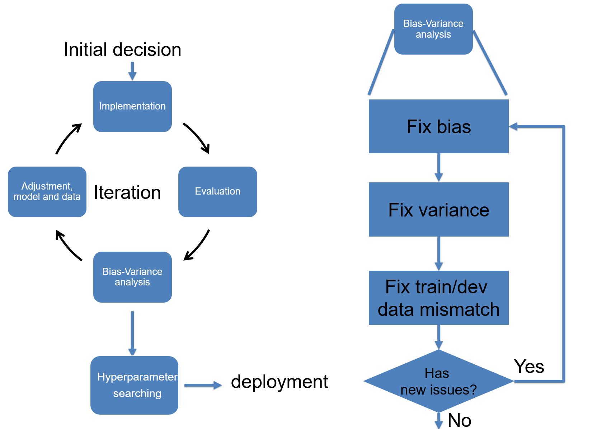

This lecture continues our discussion on training setup, with focus on handling data mismatching between training and test sets. The meaning and strategy to conduct error analysis are introduced. After finishing the training section, we discuss the method for data pre-processing and how to initialize the model parameters. The final section of this lecture introduces the deep learning debugging and iteration for model training. Tools for debugging are demonstrated.

#### Video

[To be added]()

#### Slides

[PDF Download]()

#### Suggested Reading

* [Data mismatching](https://insights.sei.cmu.edu/blog/detecting-mismatches-machine-learning-systems/)
* [Data pre-processing](https://serokell.io/blog/data-preprocessing)
* [Data transformation in TorchVision](https://pytorch.org/vision/stable/transforms.html)
* [Checklist to debug NN](https://towardsdatascience.com/checklist-for-debugging-neural-networks-d8b2a9434f21)

___
### **Assignment 2**

[Download the Assignment 2](https://gadgetrondata.blob.core.windows.net/dlcc/assignment2.zip)

In this assignment, you will study the autodiff in Pytorch, which is essential to understand how DL models work. Then you will implement a MLP model using Pytorch on the Cifar10 dataset. Another important aspects in this assignment is the experimental management, using the [wandb](https://wandb.ai/site).

___
### **Lecture 6**

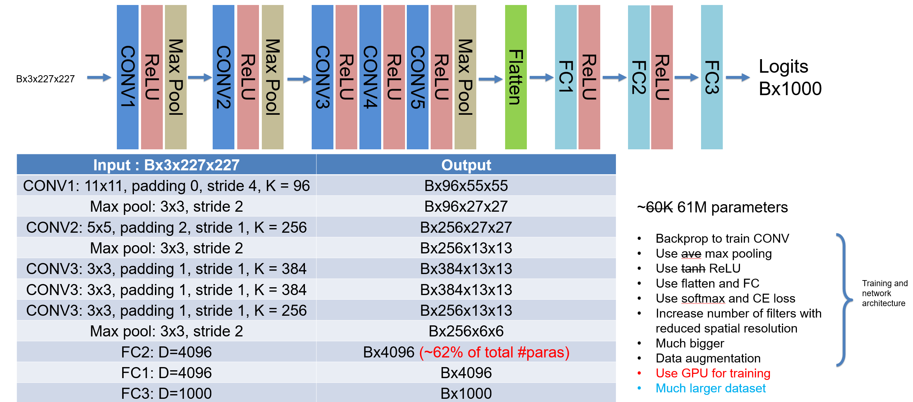

This lecture starts the convolutional neural network (CNN) by introducing the convolution operation and its application on image. Different variants of convolution is discussed, including stride, transpose, dilated CONV, 1D and 3D CONV, padding, and pooling. Image interpolation layer is introduced with other methods to up/downsample images. The batch normalization is discussed with other feature normalization methods. Two CNN architectures are analyzed, LeNet-5 and AlexNet, in the history of ImageNet challenge.

#### Video

[To be added]()

#### Slides

[PDF Download]()

#### Suggested Reading

* [CONV and its variants](https://arxiv.org/pdf/1603.07285.pdf)
* [CNN explanation](https://poloclub.github.io/cnn-explainer/)
* [Introduction for batch norm, layer norm, group norm etc.](./Normalization Techniques in Deep Neural Networks _ by Aakash Bindal _ Techspace _ Medium.pdf)
* [Overview of NN feature normalization](https://arxiv.org/pdf/2009.12836.pdf)
* [ImageNet Winning CNN Architectures](https://www.kaggle.com/getting-started/149448)

___
### **Lecture 7**

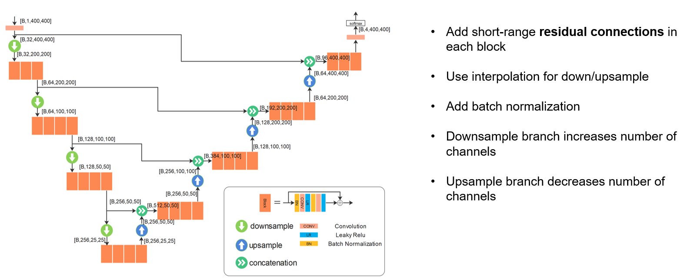

With the basics of CONV and CNN introduced in last lecture, we continue to go through the history of ImageNet competition and reviewed winning architectures until 2017 and go beyond for very latest developments, including ResNet and its variants, group convolution, mobile net, efficient net. We can learn key ideas to design and refine the CNN architectures. The second part of this lecture discusses applications of CNN, including two-stage and one-stage object detection, landmark detection, U-net for segmentation, denoising CNN and super-resolution CNN. 

Network compression is not discussed in the lecture. But you are encouraged to read more on this topic.

#### Video

[To be added]()

#### Slides

[PDF Download]()

#### Suggested Reading

* [ResNet paper](https://arxiv.org/abs/1512.03385)
* [ResNet with batch norm](https://arxiv.org/abs/1603.05027)
* [Introduction for batch norm, layer norm, group norm etc.](./Normalization Techniques in Deep Neural Networks _ by Aakash Bindal _ Techspace _ Medium.pdf)
* [Mobile, shuffle, effnet](https://towardsdatascience.com/3-small-but-powerful-convolutional-networks-27ef86faa42d)
* [One-stage object detector](https://www.jeremyjordan.me/object-detection-one-stage/)
* [ResUnet](https://arxiv.org/pdf/1711.10684.pdf)
* [Intro for network compression](https://towardsdatascience.com/how-to-compress-a-neural-network-427e8dddcc34)

___
### **Lecture 8**

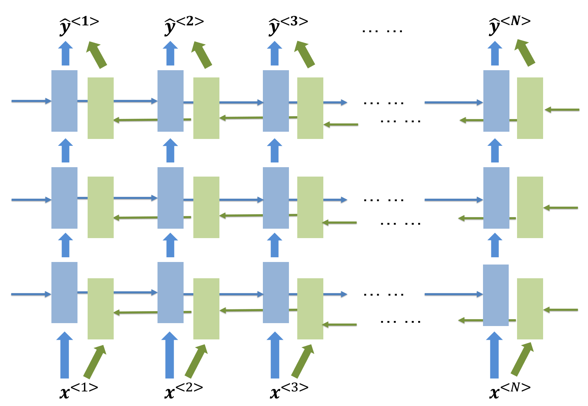

We start the discussion of recurrent neural network (RNN) in this lecture. The vanilla RNN is introduced, with two variants: multi-level RNN and bidirectional RNN. To overcome the vanishing gradient, long-short term memory (LSTM) and gated recurrent unit (GRU) modules are introduced. This lecture also introduce word embedding and sequence pre-processing techniques. The final discussion is on temporal convolution network with dilated CONV to process sequence data.

#### Video

[To be added]()

#### Slides

[PDF Download]()

#### Suggested Reading

* [RNN chapter](https://www.deeplearningbook.org/contents/rnn.html)
* [LSTM and GRU](https://towardsdatascience.com/illustrated-guide-to-lstms-and-gru-s-a-step-by-step-explanation-44e9eb85bf21)
* [The Unreasonable Effectiveness of Recurrent Neural Networks](http://karpathy.github.io/2015/05/21/rnn-effectiveness/)

___
### **Lecture 9**

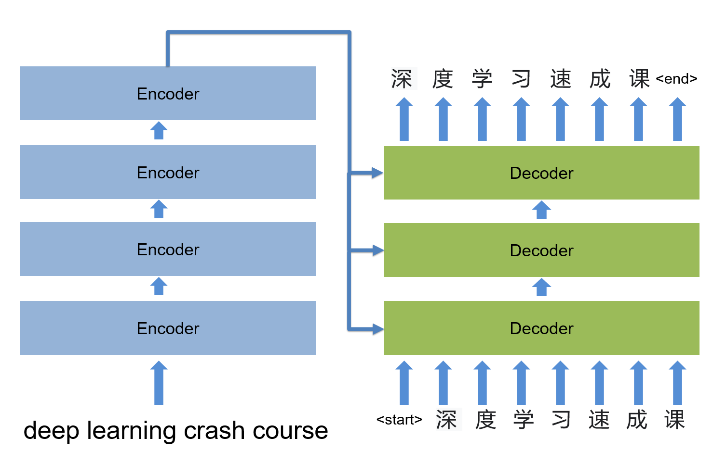

This lecture is an exciting one to introduce the attention mechanism and latest transformer based models which had demonstrated great success in natural language processing applications and showing promising the computer vision tasks. The discussion starts by introducing the self-attention and transformer module in details and extend to seq-to-seq model. The BERT and GTP-2/3 architectures are reviewed with details for training and inference. This lecture ends with reviewing application of transformer to computer vision tasks.

#### Video

[To be added]()

#### Slides

[PDF Download]()

#### Suggested Reading

* [Attention and transformer](http://peterbloem.nl/blog/transformers)
* [Attention is all your need](http://nlp.seas.harvard.edu/2018/04/03/attention.html)
* [Seq model and CTC loss](https://distill.pub/2017/ctc/)
* [GPT as a few shot learner](https://arxiv.org/abs/2005.14165)
* [Vision transformer](https://ai.googleblog.com/2020/12/transformers-for-image-recognition-at.html)
* [GPT playground](https://app.inferkit.com/demo)

___
### **Lecture 10**

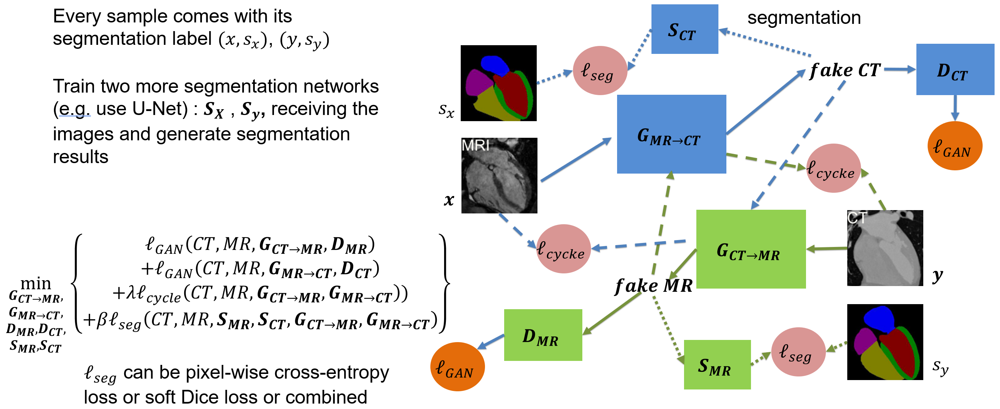

So far we had discussed discriminative models which learn the decision boundary to make prediction. In this lecture, we start to discuss the generative model which learns the data distribution and allows sampling from that distribution. We start by discussing the differences and links between generative and discriminative models. Then the G/D design of generative adversarial model is introduced. The GAN loss is analyzed in detail and its optimal solution is derived. Examples are presented for the significant progress in GAN framework. We further extend the discussion to conditional GAN and CycleGAN to review its flexibility. The lecture is concluded by presenting an usecase utilizing the CycleGAN with segmentation consistency for medical imaging application.

#### Video

[To be added]()

#### Slides

[PDF Download]()

#### Suggested Reading

* [GAN paper](https://arxiv.org/abs/1406.2661)
* [GAN talk](https://www.youtube.com/watch?v=HGYYEUSm-0Q)
* [Conditional GAN](https://arxiv.org/abs/1611.07004)
* [Cycle GAN](https://arxiv.org/abs/1703.10593)

___
### **Lecture 11**

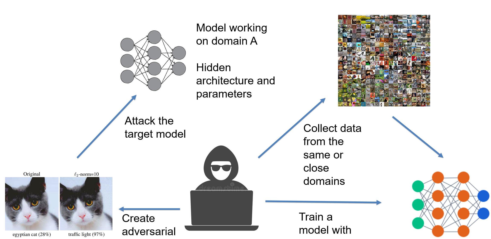

This lecture discusses two related topics in deep learning: adversarial examples and deep NN visualization. Shortly after the take-off of deep NN in 2021, people found these models can be fooled by images looking normal to human eyes, while models will misclassified them with very high confidence. These examples are called adversarial examples. The cause for this phenomenon is discussed in the lecture with methods to generate adversarial examples and how to defend it. Understanding what models learned can help, which leads to techniques for model visualization. In the second part of lecture, different model visualization methods are reviewed, including occlusion, saliency maps, Grad-CAM and guided backprop.

#### Video

[To be added]()

#### Slides

[PDF Download]()

#### Suggested Reading

* [Adversarial examples](https://arxiv.org/abs/1412.6572)
* [Adversarial machine learning](https://www.youtube.com/watch?v=sucqskXRkss)
* [Visualization of deep NN](https://arxiv.org/abs/1311.2901)
* [Grad Cam](https://arxiv.org/abs/1610.02391)

___
### **Lecture 12**

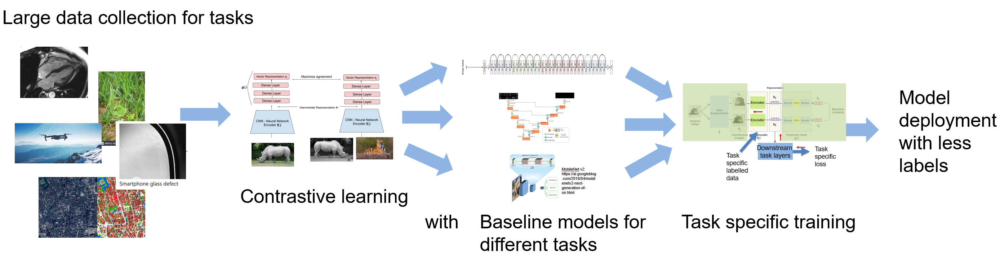

Deep learning works great if we have large amount of clean, diverse and labelled data. What if we only have a small amount of labelled data or a lot of data without labelling? This lecture introduces some techniques for these more realistic scenario, including transfer learning, meta learning and contrastive learning. The algorithms and utilities of these methods are discussed with real-world examples. The contrastive learning, as the latest development in self-supervised learning, is of particular interests to enable the usage of large unlabeled data. The lecture introduces SimCLR and MoCo algorithms and discusses the contrastive learning as the backbone for multi-modality usecases.

#### Video

[To be added]()

#### Slides

[PDF Download]()

#### Suggested Reading

* [Self-supervised learning](https://ai.facebook.com/blog/self-supervised-learning-the-dark-matter-of-intelligence)
* [Learn to learn, Lil'Log](https://lilianweng.github.io/lil-log/2018/11/30/meta-learning.html)
* [Self-Supervised Representation Learning, Lil'Log](https://lilianweng.github.io/lil-log/2019/11/10/self-supervised-learning.html)
* [MAML](https://arxiv.org/abs/1703.03400)
* [SimCLR, a fun paper to read](https://arxiv.org/abs/2002.05709)
* [SimCLR v2](https://www.youtube.com/watch?v=2lkUNDZld-4&t=34s)

___
### **Closing remarks**

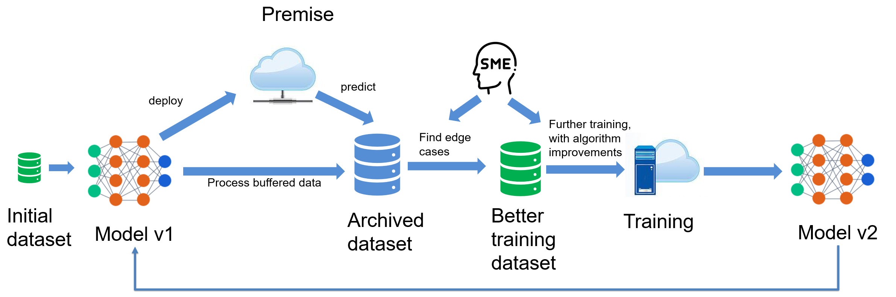

During this course, we learned many deep learning models and algorithms, and gained mindsets to work with DL. In this closing remark, we step back to take a bird-eye view of what we had learned. The big picture is DL is becoming an essential technology to create substantial value to the society for the decade to come. To achieve this potential, the machine learning system and effective development/deployment iteration are more important, leading to the rise of MLOps. As domain experts, adding DL to your expertise is a good way to get started. For many of us, it may be the only feasible way. So some more resources are provided for continuous learning. 

#### Suggested Reading
* [Machine Learning System Design](https://github.com/chiphuyen/machine-learning-systems-design.git)
* [MLOps](https://cloud.google.com/architecture/mlops-continuous-delivery-and-automation-pipelines-in-machine-learning)
* An insightful post for future of AI society [Moore's Law for Everything](https://moores.samaltman.com)