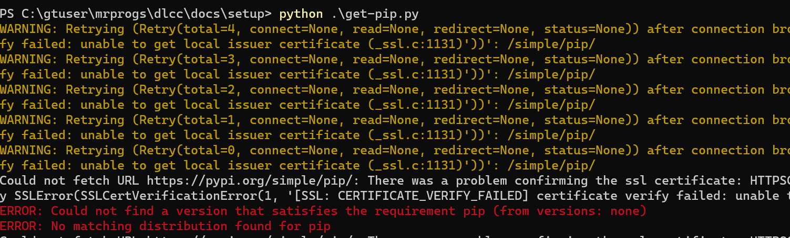
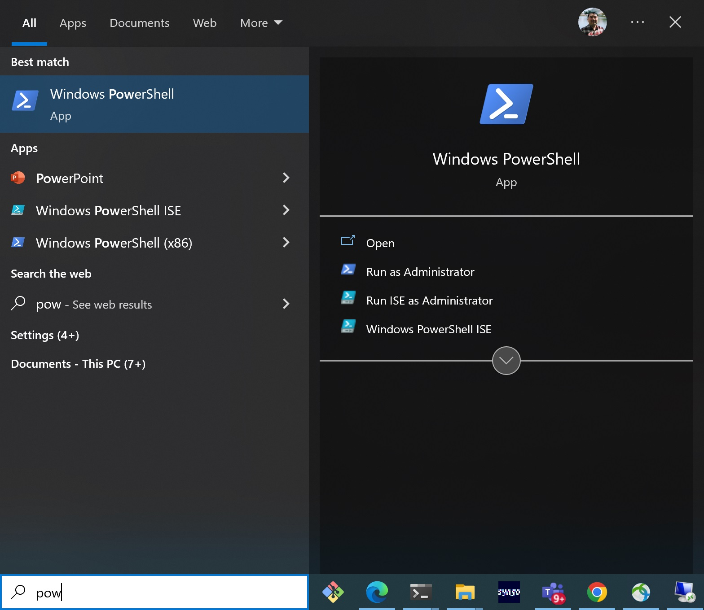
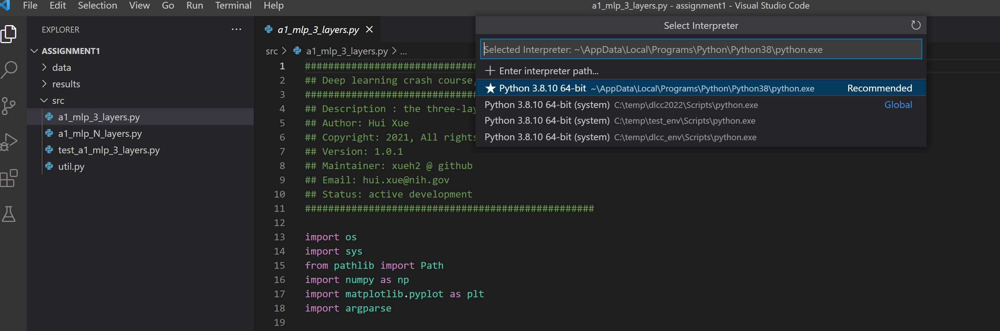
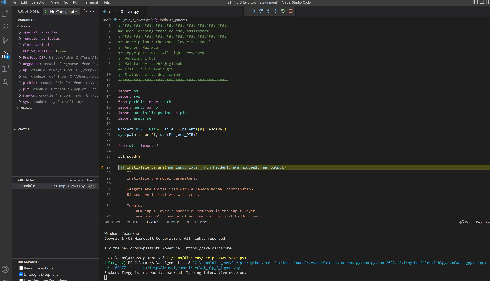

___
# Setup for deep learning development, NHLBI

This guideline provides tutorial for how to set up deep learning development environment for the NHLBI internal setup. Due to the limitation of NIH network, we will focus on setting up the NHLBI windows computers.

## Install NVIDIA driver and CUDA, if your computer has a GPU

- Download the [CUDA installer](https://developer.download.nvidia.com/compute/cuda/11.6.2/local_installers/cuda_11.6.2_511.65_windows.exe) for windows

- Double click cuda_11.6.2_511.65_windows.exe

- Follow on-screen prompts

## Install python and pip

- Download the [python 3.8 installer](https://www.python.org/ftp/python/3.8.10/python-3.8.10-amd64.exe)
- Unzip and double click
- Use all default values and install this package

## Install python pip

```
cd c:\temp
curl https://bootstrap.pypa.io/get-pip.py -o get-pip.py
python get-pip.py
```

If you get this error:



it can be fixed by:

- Go to windows run. Type %appdata%
- Go to the folder pip and edit the pip.ini file.
- If the folder doesn't exist create one and also create a pip.ini file and edit in a text editor.
- Add the following :
```
[global]
trusted-host = pypi.python.org
               pypi.org
               files.pythonhosted.org
               raw.githubusercontent.com
               github.com
               download.pytorch.org
```

## Install vscode

Go to [VSCode page](https://code.visualstudio.com/download#) and download and install this software for windows 64 bit.

## Create python virtual environment

First, open the windows power-shell



Then, create python virtual environment:

```
cd c:\temp
python -m venv dlcc_env
```

Activate the dlcc_env. In the power-shell, run:

```
 .\dlcc_env\Scripts\activate
```

Install the required packages:

- Download https://deeplearningcrashcourse.org/setup/requirements.txt and save it into c:\temp\requirements.txt

```
pip install -r .\requirements.txt
```

## Use vscode in the virtual environment

Download the assignment 1 from:

https://gadgetrondata.blob.core.windows.net/dlcc/assignment1.zip

Save it into e.g. c:\temp\A1 and unzip the package

Then use the vscode to open the assignment 1:

```
code .\A1\assignment1\ 
```


One extra step we need to do is to let vscode use the virtual environment:

Click "View", then "Command and Palette", then type "Python: Select Interpreter", then select the one for dlcc_env (last one in the list here):



After this, you can start debug/code up the assignment source files:



## Pytorch with GPU

By default, the cpu version of pytorch was installed. If you have gpu setup, you may want to uninstall cpu version and install GPU pytorch:

```
# in the dlcc_env
pip uninstall torch torchvision torchaudio
# install gpu version
pip install torch torchvision torchaudio --extra-index-url https://download.pytorch.org/whl/cu116
```