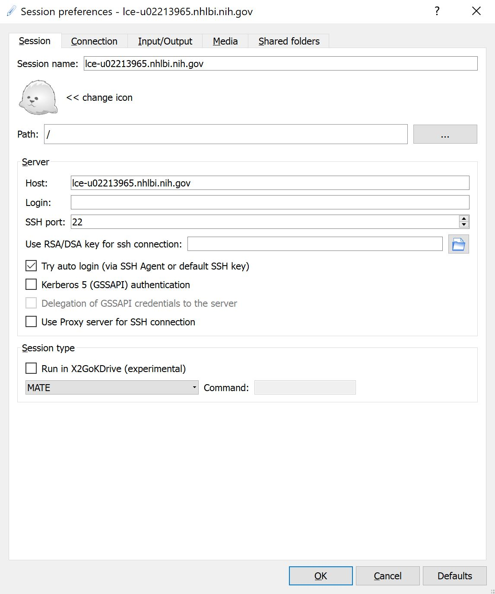
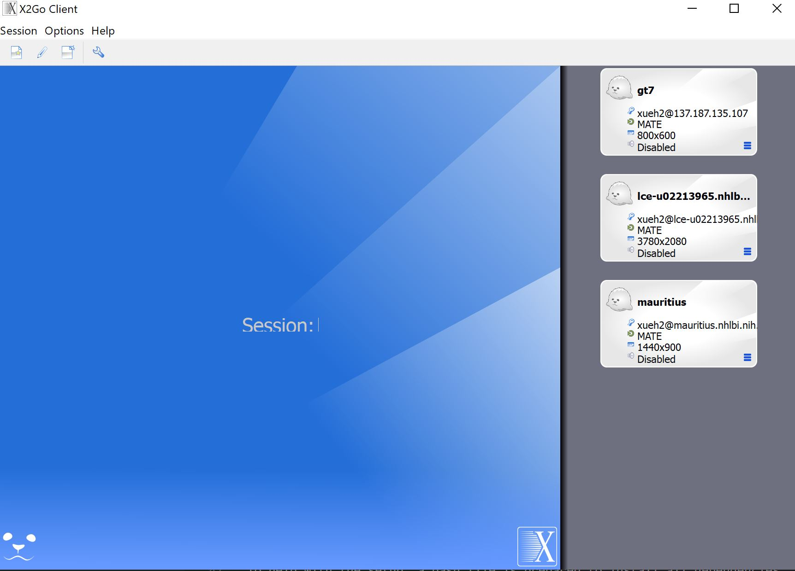
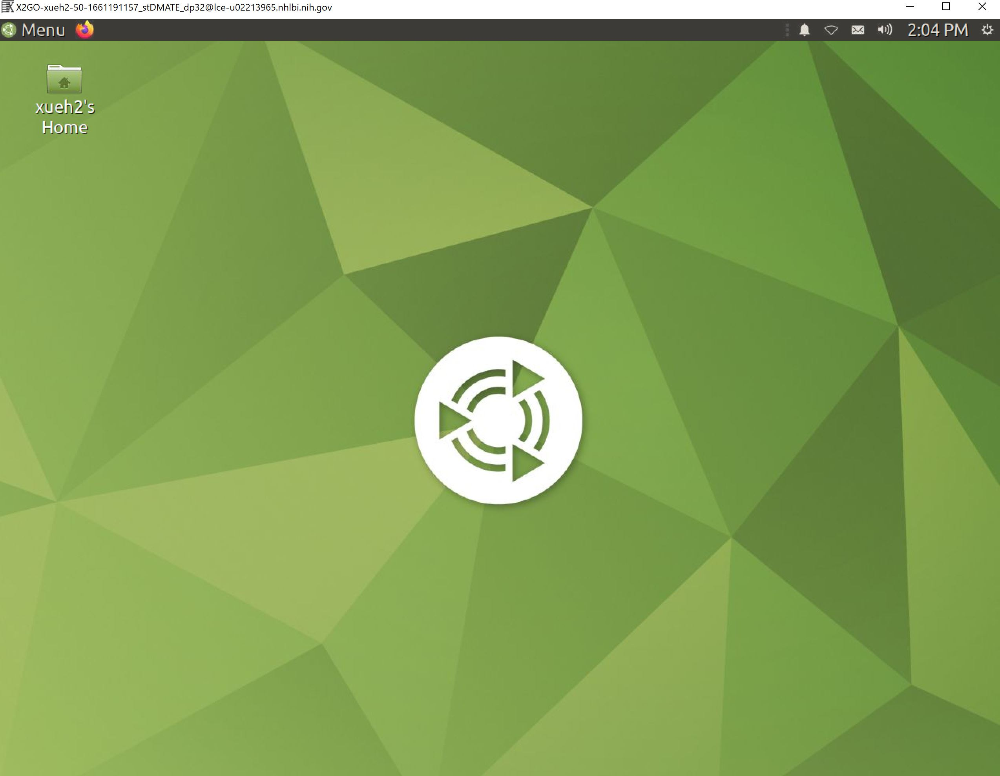

___
# Setup for deep learning development, NHLBI

This guideline provides tutorial for how to set up deep learning development environment for the NHLBI internal setup. Due to the limitation of NIH network, user has to use their PIV cards to log into the linux server computers and set up their virtual environment. GPUs will be avaiable on the linux servers.

The linux server used for the course is:

    lce-u02213965.nhlbi.nih.gov

## Register your ssh key

 https://authinternal.nih.gov/sshkeyregistration

## Install the putty-cac

First, please download and install putty-cac:

https://github.com/NoMoreFood/putty-cac/raw/0.77/binaries/puttycac-64bit-0.77-installer.msi

To use the putty-cac to log into the linux server, you need to have the PIV card and set up putty and pageant. The instruction is at:

https://playbooks.idmanagement.gov/piv/engineer/ssh/

## Log in with graphic interface

Second, on the *Windows* side (suppose you are using MS Windows to log into the linux computer), download and install the [x2go client 4.1.0.0](https://code.x2go.org/releases/binary-win32/x2goclient/releases/4.1.0.0-2017.03.11/x2goclient-4.1.0.0-2017.03.11-setup.exe). Note the latest x2go 4.2 does not work with the current linux server, so we have to use version 4.1.

Last, start the x2go client to remote into the ubuntu server:

- set up the x2go connection as this:



make sure put in the ip in this "Host" and select **MATE** in the "Session type".

- After clicking **OK**, the session should be saved:



- Click this session You now log into the ubuntu remote serve with mate desktop:



## Set up python environment

To help with the setup, we will use python virtual environment. You can read more about python virtual environment [here](https://realpython.com/python-virtual-environments-a-primer/):

```
# set up your environment
cd ~
python3 -m venv mydlcc2022

# then, activate the environment
source ~/mydlcc2022/bin/activate

# then, you can install dependent software
wget https://deeplearningcrashcourse.org/setup/requirements_linux.txt
pip3 install -r ~/requirements_linux.txt

# then, to use wandb for experiment management, we have to set up the virtual environment once
cat /etc/pki/NIH/NIH-DPKI-ROOT-1A.pem   >> $(python3 -c "import certifi; print(certifi.where());")

# then, install pytorch
pip3 install torch torchvision torchaudio --extra-index-url https://download.pytorch.org/whl/cu116
```

Remember to activate your virtual environment everytime you log in to the computer:
```
source ~/mydlcc2022/bin/activate
```