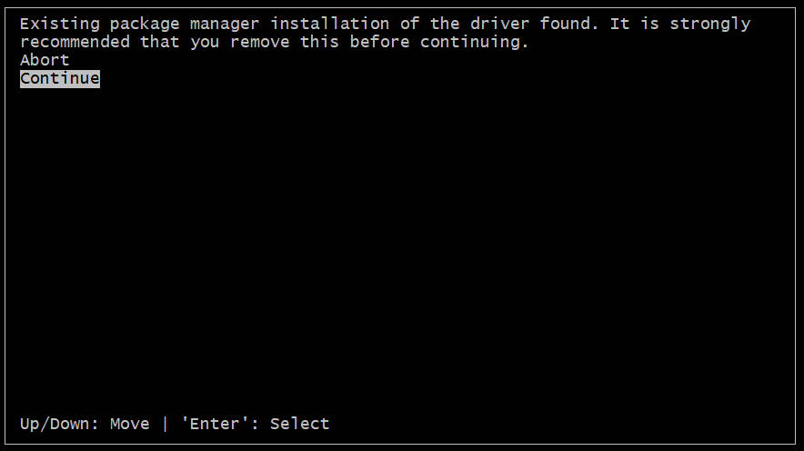
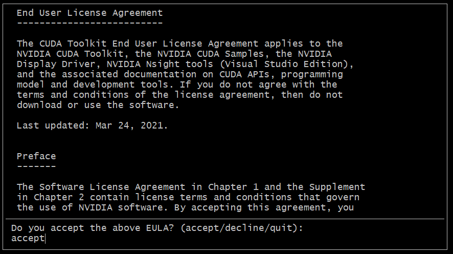
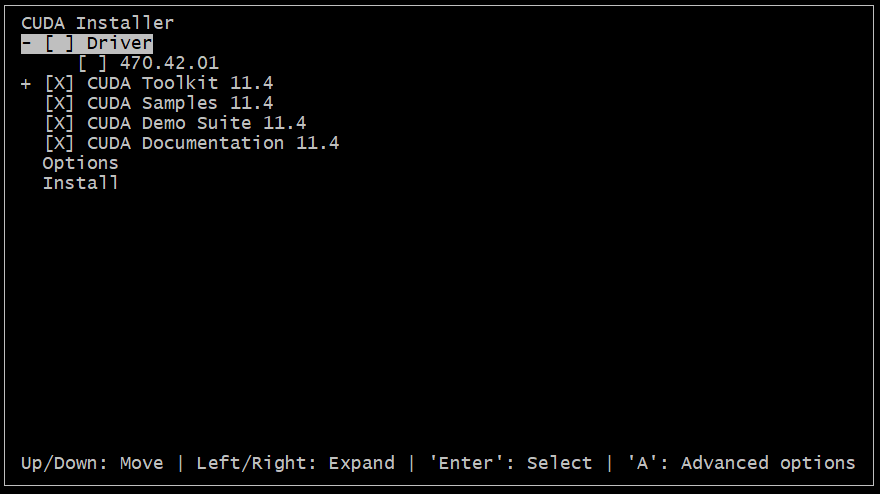
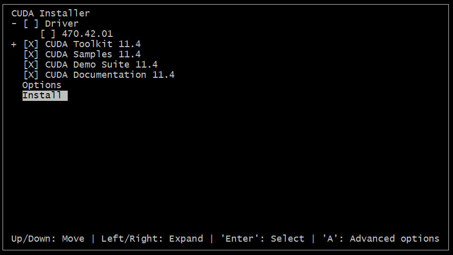
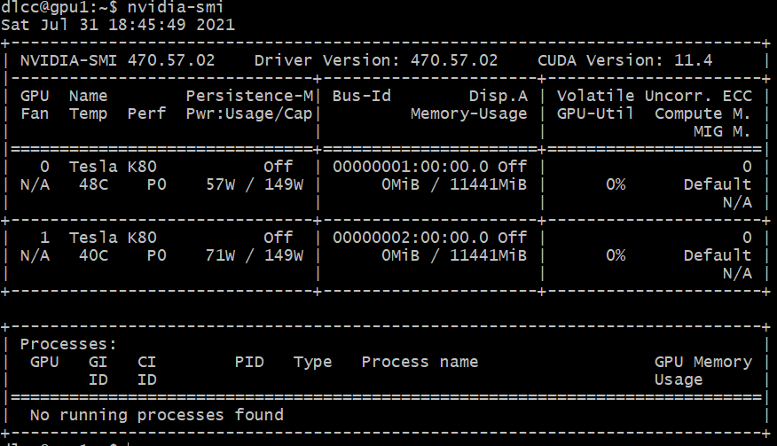
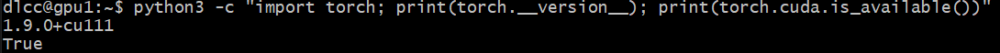
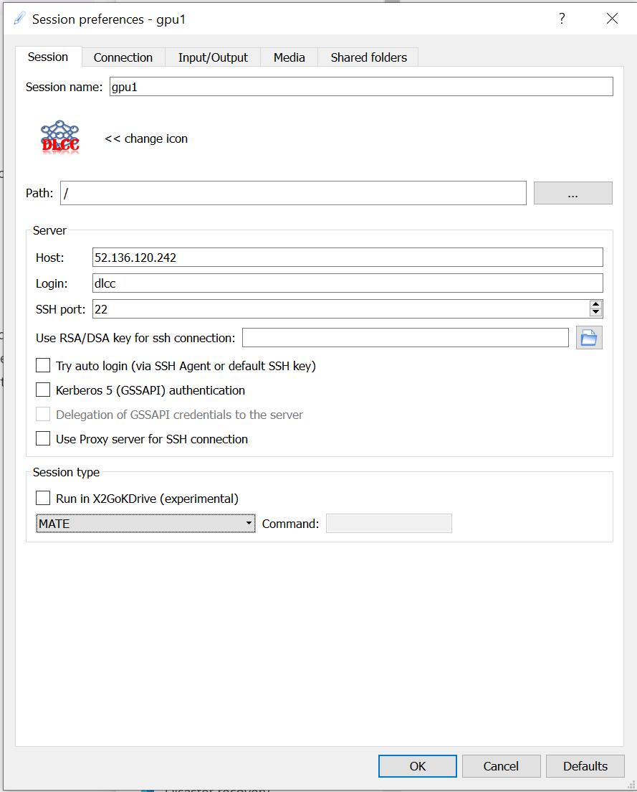
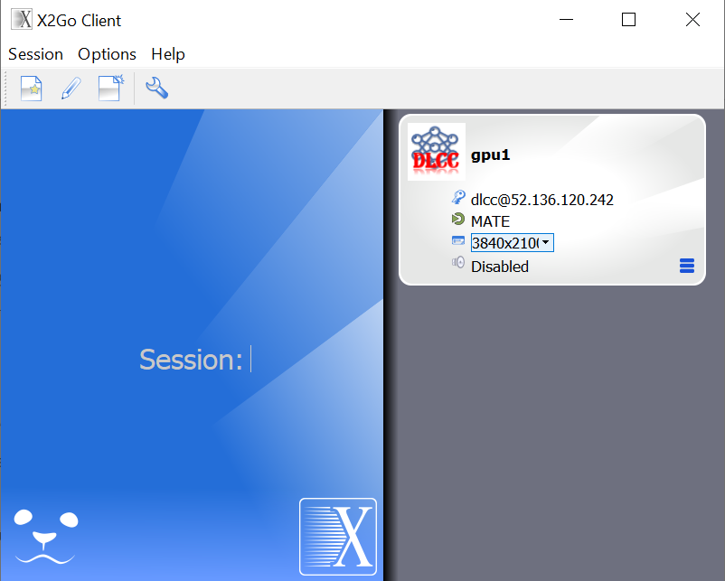
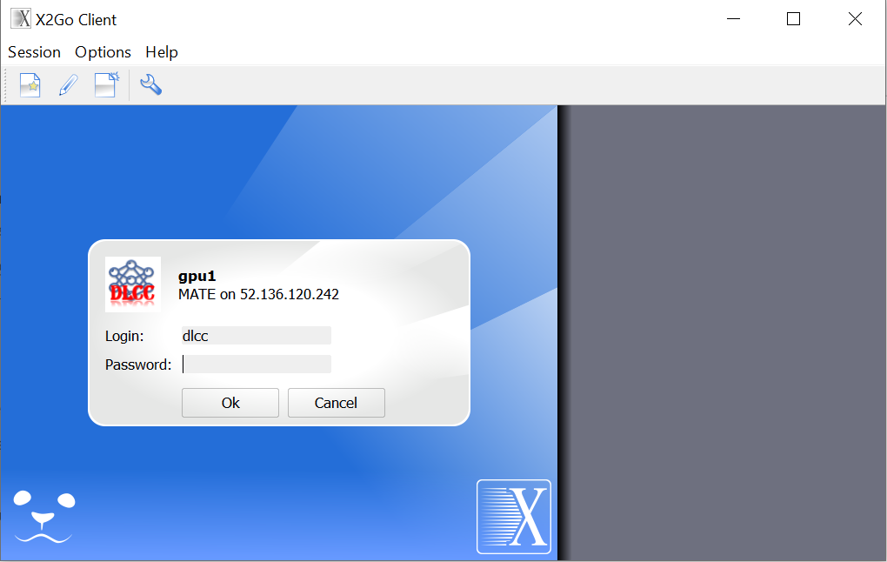
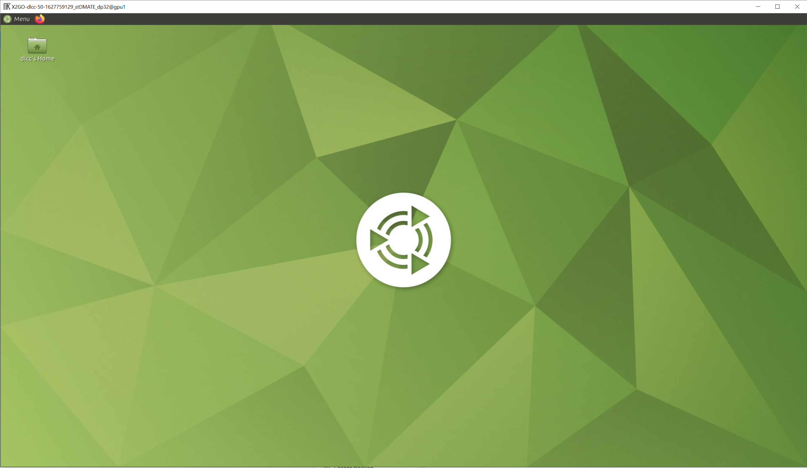

___
# Setup for deep learning development, Ubuntu 20.04

This guideline provides tutorial for how to set up deep learning development environment for [Ubuntu 20.04](https://ubuntu.com/). To complete the assignments of this course, it is required for all participants to set up their deep learning environment. Since the later problems involve more complicated model and larger datasets, the Nvidia GPU is required. This guide demonstrates the setup for GPU as well as the python components.

As an overview, following software and tools are used in this course:

    * Python3.8
    * Pytorch 1.9, for cuda 11
    * VSCode for coding and debugging
    * wandb (weights and biases) for the experiment management and hyperparameter searching
    * To remote log into the graphic desktop of Ubuntu system, X2go server and client are used

## Install NVIDIA driver

First, install the nvidia driver for the GPU cards. If your GPU is already set up, you can skip this step.

```
# remote old installation if any
sudo apt-get --purge remove cuda*
sudo apt-get remove --purge nvidia-*

# add nvidia driver ppa
sudo add-apt-repository ppa:graphics-drivers/ppa

# update software cache
sudo apt update
sudo apt upgrade -y

# install driver
sudo apt-get install ubuntu-drivers-common
# recommend to install driver version 470
sudo ubuntu-drivers install 470

# then reboot the computer
sudo reboot now
```
## Install dependent software

To help with the setup, a bash file is prepared to install all dependencies, including software packages and python packages:
[install_ubuntu_dependencies.sh](setup/install_ubuntu_dependencies.sh)

Please copy this file to your computer and run:
```
# suppose the working directory is ~/software
cd ~/software
wget https://deeplearningcrashcourse.org/setup/install_ubuntu_dependencies.sh
dos2unix ./install_ubuntu_dependencies.sh # in case the line ending format causes problem
sudo sh ./install_ubuntu_dependencies.sh
```

## Install cuda
```
# suppose the working folder is ~/software
mkdir ~/software
cd ~/software
wget https://developer.download.nvidia.com/compute/cuda/11.4.0/local_installers/cuda_11.4.0_470.42.01_linux.run
sudo sh ./cuda_11.4.0_470.42.01_linux.run
```

When installing CUDA, first select "Continue":


then type in "accept":



make sure **uncheck** driver:



then move the cursor to "Install":



Third, check the GPU card is working
```
# run this command
nvidia-smi

# you may want to enable the persistent mode to save time
sudo nvidia-smi -pm 1
```

If the GPU is up and running, you should see information like this:


## Install pytorch

```
sudo pip3 install torch==1.9.0+cu111 torchvision==0.10.0+cu111 torchaudio==0.9.0 -f https://download.pytorch.org/whl/torch_stable.html
```

After the installation, please check pytorch is installed properly:
```
python3 -c "import torch; print(torch.__version__); print(torch.cuda.is_available())"
```

If pytorch is installed correctly, you should see this:



## Set up the remote desktop

This part of setup is to enable your windows computer to remote login the ubuntu computer with graphic interface.

First, on the ubuntu side, install x2go server and mate desktop
```
# install x2go server
sudo add-apt-repository ppa:x2go/stable
sudo apt-get update
sudo apt-get install x2goserver x2goserver-xsession

# install ubuntu mate desktop
sudo apt install tasksel
sudo tasksel install ubuntu-mate-desktop

# reboot
sudo reboot now
```

Second, on the *Windows* side (suppose you are using MS Windows to log into the linux computer), download and install the [x2go client](https://code.x2go.org/releases/X2GoClient_latest_mswin32-setup.exe). 

Last, start the x2go client to remote into the ubuntu server:

- set up the x2go connection as this:



make sure put in the ip in this "Host" and select **MATE** in the "Session type".

- After clicking **OK**, the session should be saved:



- Click this session and type in the password:



- You now log into the ubuntu remote serve with mate desktop:

