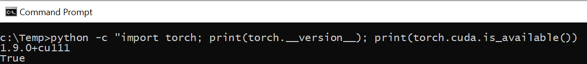

___
# Setup for deep learning development, Windows 10

This guideline provides tutorial for how to set up deep learning development environment for Windows 10. To complete the assignments of this course, it is required for all participants to set up their deep learning environment. Since the later problems involve more complicated model and larger datasets, the Nvidia GPU is required. This guide demonstrates the setup for GPU as well as the python components.

As an overview, following software and tools are used in this course:

    * Python3.8
    * Pytorch 1.9, for cuda 11
    * VSCode for coding and debugging
    * wandb (weights and biases) for the experiment management and hyperparameter searching
    * To remote log into the graphic desktop of Ubuntu system, X2go server and client are used

## Install NVIDIA driver and CUDA

- Download the [CUDA installer](https://developer.download.nvidia.com/compute/cuda/11.4.0/local_installers/cuda_11.4.0_471.11_win10.exe) for windows

- Double click cuda_11.4.0_471.11_win10.exe

- Follow on-screen prompts

## Install python and pip

- Download the [python 3.8 installer](https://www.python.org/ftp/python/3.8.10/python-3.8.10-embed-amd64.zip)
- Unzip and double click
- Use all default values and install this package

## Install python pip

```
cd c:\temp
curl https://bootstrap.pypa.io/get-pip.py -o get-pip.py
python get-pip.py
```

If you get this error:


it can be fixed by:

- Go to windows run. Type %appdata%
- Go to the folder pip and edit the pip.ini file.
- If the folder doesn't exist create one and also create a pip.ini file and edit in a text editor.
- Add the following :
```
[global]
trusted-host = pypi.python.org
               pypi.org
               files.pythonhosted.org
               raw.githubusercontent.com
               github.com
```

## Install vscode

Go to [VSCode page](https://code.visualstudio.com/download#) and download and install this software for windows 64 bit.

## Install python packages

To help with the setup, a bash file is prepared to install all dependencies, including software packages and python packages:
[install_windows_dependencies.bat](setup/install_windows_dependencies.bat)

Please copy this file to your computer and open a cmd window :

```
%% suppose the working directory is c:\temp
cd c:\temp
install_windows_dependencies.bat
```

After the installation, please check pytorch is installed properly:
```
python -c "import torch; print(torch.__version__); print(torch.cuda.is_available())"
```

If pytorch is installed correctly, you should see this:


